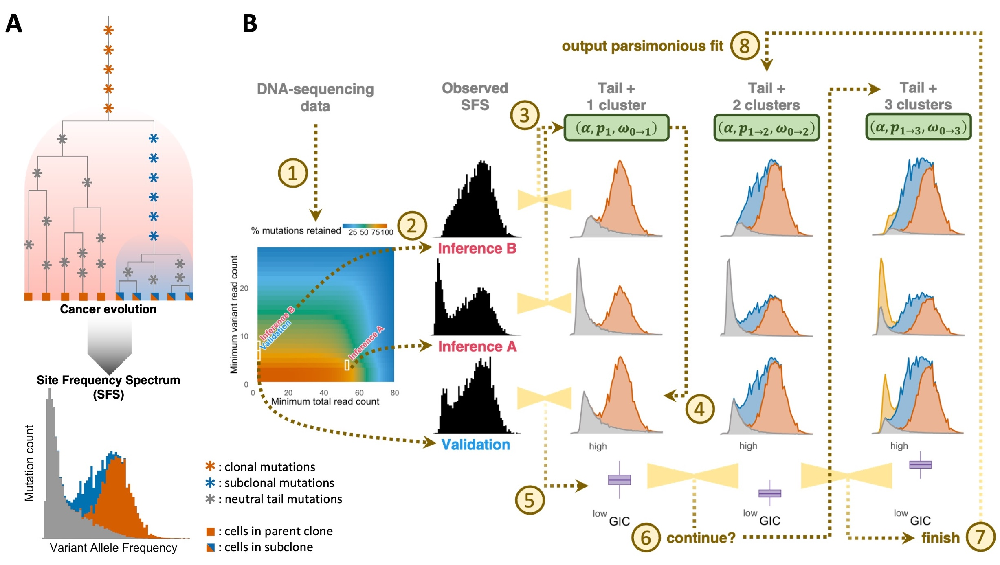

#   Deconvolution of mutations into neutral tail and clusters, with corrections for sequencing and mutation calling biases

##  Installation

DECODE (Deciphering Cancer Origin from DNA Evolution) is an algorithm to decompose genomic variants into the neutral tail and mutation clusters based on their Variant Allele Frequencies (VAFs), with corrections for sample-specific DNA-sequencing coverage distribution and mutation calling biases in the Site Frequency Spectrum (SFS).

The DECODE library can be installed with

```R
devtools::install_github("dinhngockhanh/DECODE")
```

Detailed descriptions of how to run DECODE and analyze its output can be viewed in the INTRODUCTORY VIGNETTE.

##  Methodology

DECODE infers clonality in a tumor sample based on the site frequency spectrum (SFS), the distribution of somatic mutations by their variant allele frequency (VAF).
The shape of the SFS encodes evolutionary history.
Clonal mutations form a cluster at high VAFs, and each subclone contributes a lower-VAF cluster.
Furthermore, regardless of whether the tumor evolves neutrally or undergoes selective sweeps, neutral mutations that accumulate as cells divide generate a characteristic power-law tail in the SFS.
By decomposing this spectrum and recovering the number and sizes of subclones present, DECODE estimates intra-tumor heterogeneity (ITH) and the ongoing tumor evolution.

<p align="center">
  
</p>
<p align="center">
  <small><em>
    A: clonal evolution's connection to the SFS. 
    B: schematic overview of DECODE's algorithm.
  </em></small>
</p>

DECODE is based on [our mathematical framework for the SFS](https://doi.org/10.1214/19-STS7561), 